  

---

### 🛠️ Tech Stack

  
  
  
  
  
  
  
  
  

---

### 📈 Stats

<!-- 

  
  
  
  
  

 -->

---

### 👾 Contribution Graph

  <picture>
    <source media="(prefers-color-scheme: dark)" srcset="https://raw.githubusercontent.com/Alanlan21/Alanlan21/output/pacman-contribution-graph-dark.svg">
    <source media="(prefers-color-scheme: light)" srcset="https://raw.githubusercontent.com/Alanlan21/Alanlan21/output/pacman-contribution-graph.svg">
    
  </picture>

---

### 📌 Featured Projects

<!-- 

  
  
  

 -->

---

### 📫 Contact

  
  
  

